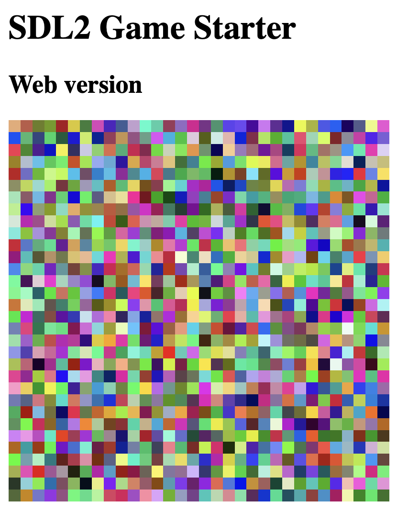

# SDL2 Game Template

This is a minimal C program that can be built into web and native targets (currently, only Mac OS X is supported).


## Instructions

1. Install Emscripten SDK:<br/>
https://emscripten.org/docs/getting_started/downloads.html

2. Clone this repository:<br/>
```bash
git clone git@github.com:diraneyya/sdl2-game-starter.git
cd sdl2-game-starter
```

3. Run `make web` to make the web app (`index.html`)

4. Run `make macos` to make the native Mac OS app (`index.app`). 

5. For the web app, you will need to run `index.html` from a web server (e.g. from the _live server_ in vscode). You can also use the `emrun` [command](https://emscripten.org/docs/compiling/Running-html-files-with-emrun.html) for this (from the Emscripten SDK):
```bash
emrun index.html
```

## Web app



## Mac OS X native app


